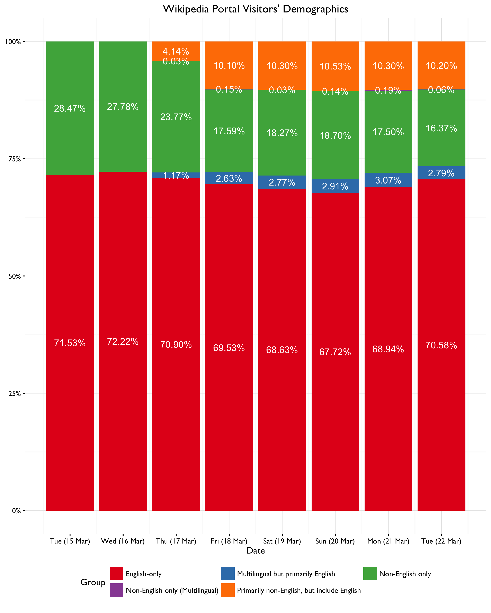
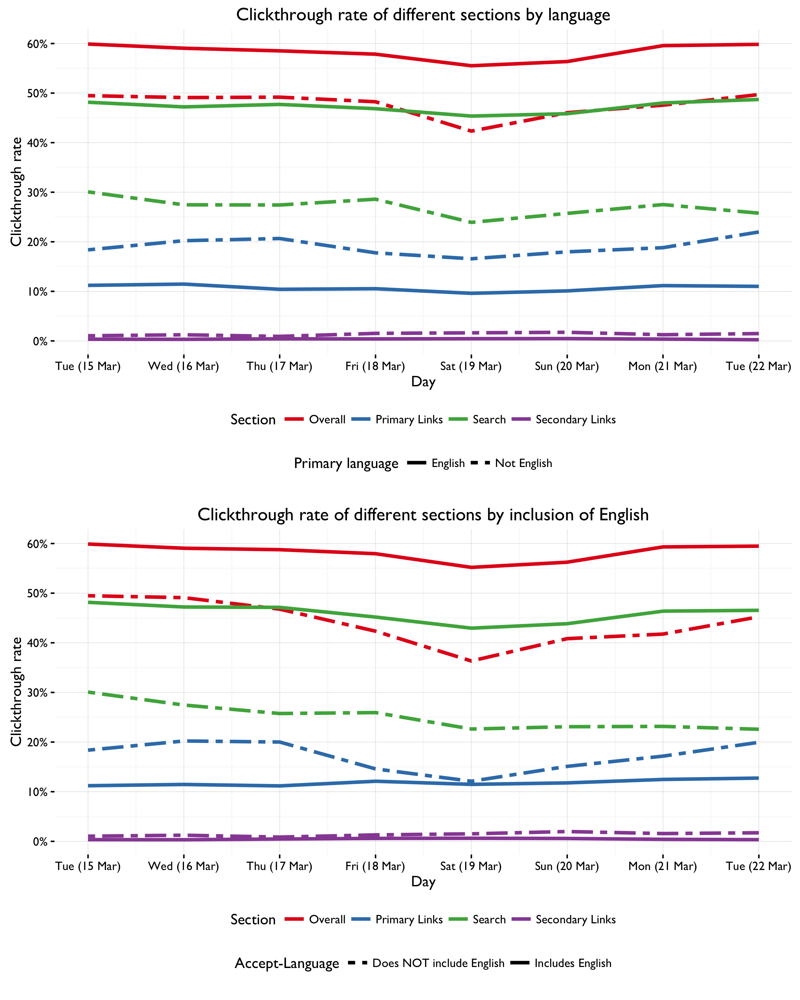
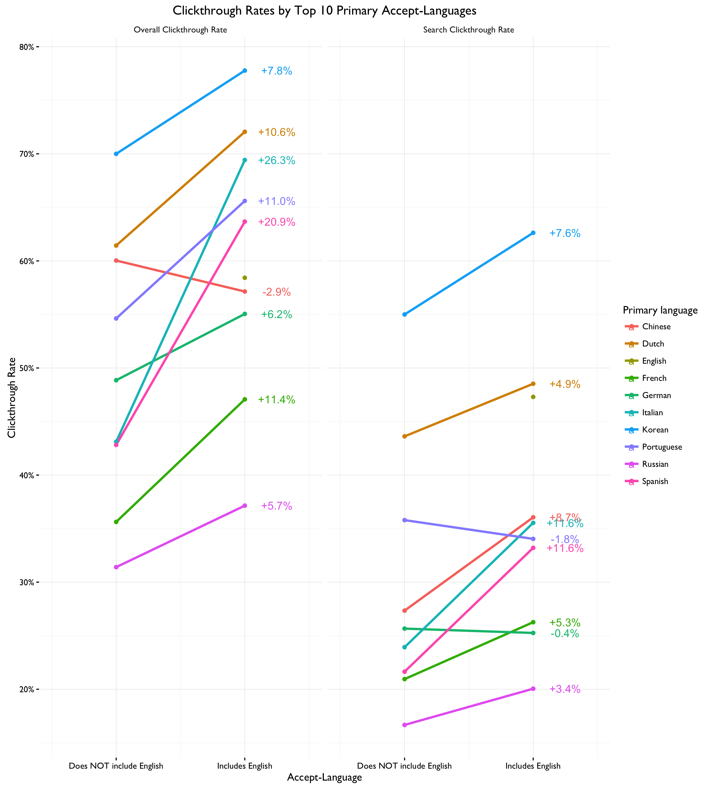
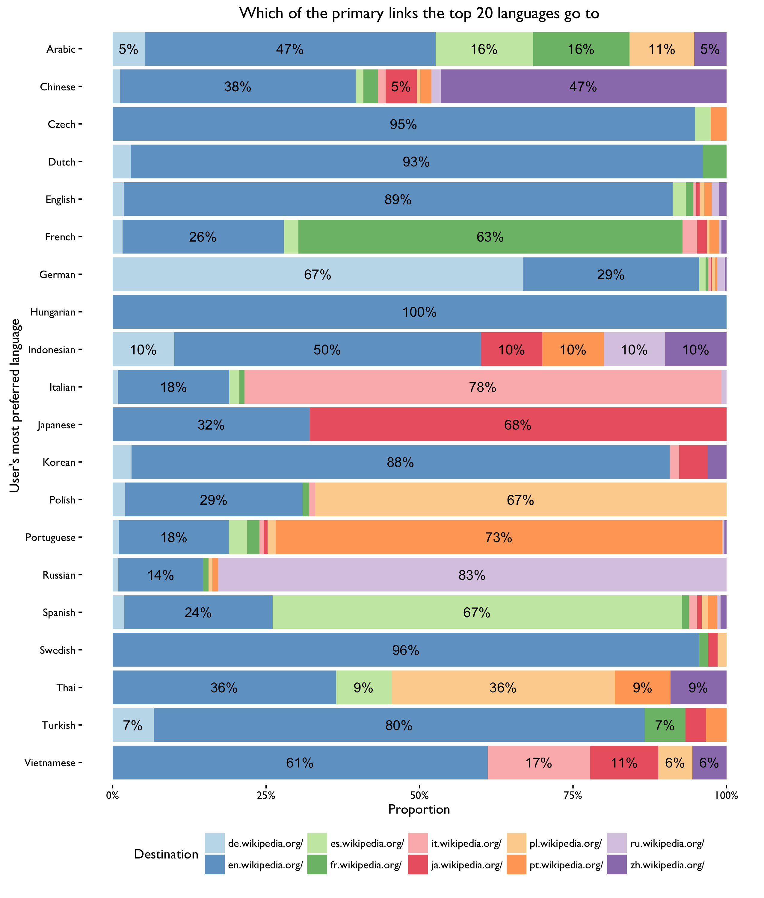
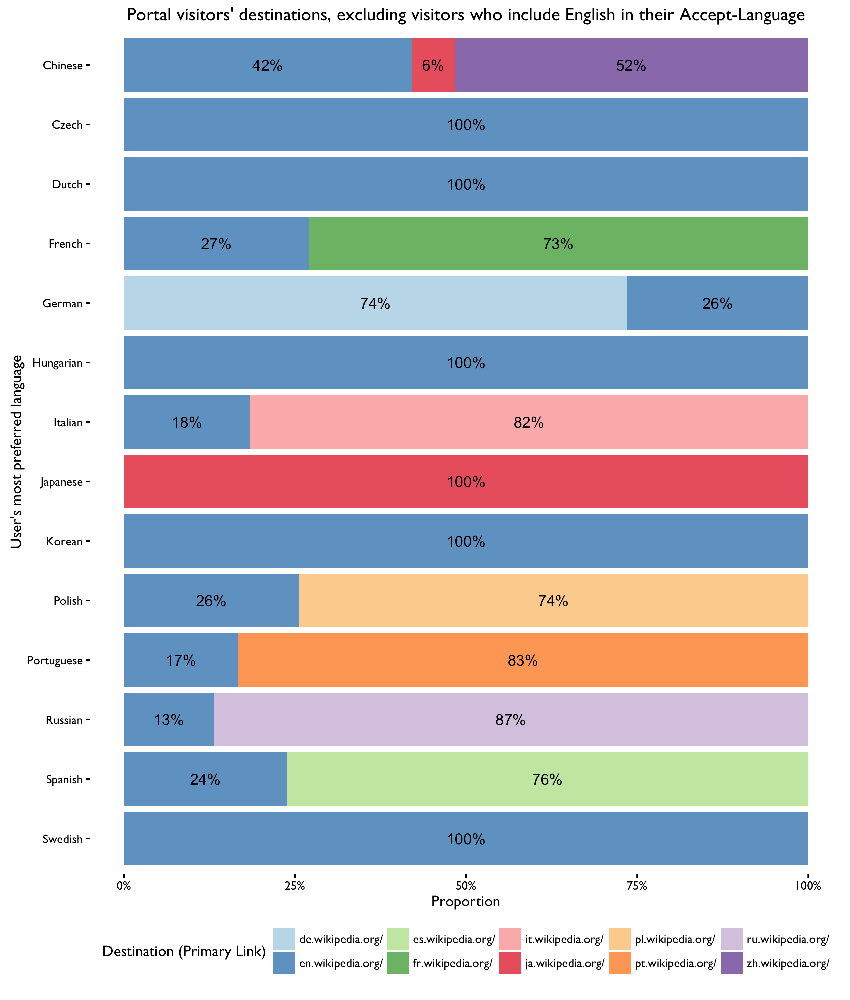

```{r setup, include = FALSE}
knitr::opts_chunk$set(echo = FALSE, message = FALSE, warning = FALSE)
```

\renewcommand{\abstractname}{Executive Summary}
\begin{abstract}
The Wikimedia Foundation (WMF) is dedicated to encouraging the growth, development, and distribution of free, \emph{multilingual}, educational content. WMF operates Wikipedia, a project to build free encyclopedias in \textit{all languages of the world}. For the Discovery Department's Portal team (tasked with making the wikipedia.org a more engaging and friendlier portal to free knowledge), it is important that all visitors, regardless of language, receive a more welcoming experience.

On 17 March 2016 we deployed a patch to Wikipedia Portal to log all user preferred languages. We found that approximately 70\% of Wikipedia Portal visitors only have English as their preferred language, and approx. 18\% set a language other than English. Around 12\% of our users are multilingual (according to their browser preferences), but many of those included English.

Users whose primary language is English or who included English as a preferred language clicked through and searched at a remarkably higher rate on a daily basis than users whose primary language is another language (60\% vs 50\% and 50\% vs 30\%), but the latter group used the language links at a much higher rate than the former (10\% vs 20\%).

In fact, English-speaking visitors' overall clickthrough rate was 12.5\%-14.4\% higher than non-English-speaking visitors', and were 1.3 times more likely to click through, indicating, perhaps, that increased localization efforts could better engage our non-English-speaking visitors. Based on the data and patterns observed, we strongly support and encourage the language detection and localization efforts the Portal team has begun pursuing.
\end{abstract}

## Introduction

The Wikimedia Foundation (WMF) is dedicated to encouraging the growth, development, and distribution of free, *multilingual*, educational content. WMF operates Wikipedia, a project to build free encyclopedias in *all languages of the world*. For the Discovery Department's Portal team (tasked with making the wikipedia.org a more engaging and friendlier portal to free knowledge), it is important that all visitors, regardless of language, receive a more welcoming experience.


\newpage

## Demographics

On 14 March 2016 we submitted a patch to Portal to log all user preferred languages (also referred to as "accept-language") in the event logging (EL) system (see [T128538](https://phabricator.wikimedia.org/T128538)), and on 17 March 2016 this patch was deployed. In the breakdown of Portal visitors' language preferences in Fig. 2 we can see that most of Wikipedia Porta users only have English set as their preferred language.

In this report, we investigate how clickthrough rate (the inverse of abandonment rate) is related to Portal visitors' preferred language(s) and their usage of the various sections. In particular, we track the following clickthroughs:

- **Search**, if the user has used the Portal to search for something.
- **Primary Links**, if the user has clicked on any of the top 10 languages around the Wikipedia logo.
- **Seconday Links**, if the user has clicked on any of the other languages, located below the search box.

## Clickthrough Rates

In Fig. 3 below, we can see how radically different English and non-English speakers use and experience the Wikipedia Portal. For example, users who specified English as their most preferred ("primary") language search at a rate of almost 50%, while users who specified a different language search at a rate of about 30% -- a remarkable difference! This drop is search rate is even more striking when comparing users who included English as one of the languages they accept (also almost 50%) and users who did not (<25%).

When looking at top 10 languages (ranked by number of recorded visitors) in Fig. 4, we see a mostly consistent increased use of the search box and overall clickthrough among visitors who include English in their Accept-Language header. In fact, users who included English in their Accept-Language header were clicking through (using any of the Portal's sections) at a rate 12.5%-14.4% greater than users who did not include English, and were 1.3 times more likely to click through.

So what do non-English speakers do instead of searching Wikipedia? Depends! By the look of things they either use one of the primary links (top 10 languages) or one of the secondary links (other languages, located below the search box). In Figures 5 and 6, we see users MOSTLY click on their language (if their language is one of the top 10 around the logo), especially if their preferred languages list doesn't include English.

\newpage










