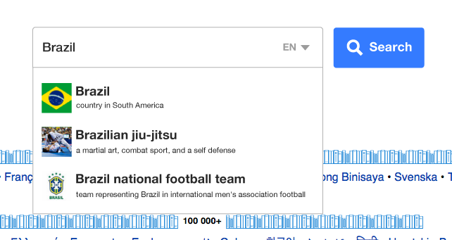

```{r setup, include = FALSE}
knitr::opts_chunk$set(echo = FALSE, warning = FALSE)
library(magrittr)
import::from(dplyr, group_by, summarize, mutate, select, rename, arrange, keep_where = filter, ungroup, top_n)
library(ggplot2)
correct_proportion <- function(x) {
  vapply(x, function(x, y) { return(min(x, y)) }, 0.0, y = 1)
}
choropleth_theme <- function() {
  return(ggthemes::theme_fivethirtyeight() +
           theme(axis.title = element_blank(), axis.text = element_blank(), axis.ticks = element_blank(),
                 legend.key.width = unit(0.6, "in"), legend.background = element_blank(),
                 panel.background = element_blank(), plot.background = element_blank(),
                 panel.grid = element_line(colour = "gray20", linetype = "dashed")))
}
```

```{r data}
aggregates <- readr::read_csv('portal-js.csv')
requests <- keep_where(aggregates, date > as.Date("2016-02-05"))
```

\renewcommand{\abstractname}{Executive Summary}
\begin{abstract}
On 5 February 2016 we deployed a patch to the Wikipedia Portal moving the inline JavaScript into a separate file, which enabled us to finally measure the proportion of traffic with JS support separate from the overall traffic to the Portal. This report covers logs of HTTP request from 5 Feb to 10 Feb, 2016.

Overall, 93\% of the requests made to the Wikipedia Portal have JS support. However, a large component (45\%) of this overall percentage is accounted by traffic from United States, which has an overall proportion of 96\%. The remaining 55\% of the traffic from 234 other countries show a lot of variation in JS support, with 86.5\% on average.

We also performed an analysis of browser usage and learned that approx. 75\% of the traffic comes from users with relatively modern browsers, with a few exceptions such as Internet Explorer 8 (3.2\% of total traffic). Of those 17 browsers, 14 had populations with more than 93\% JS support. That is, less than 7\% of those browsers' users had turned off JavaScript for privacy/bandwidth/other reasons. Interestingly, only 80\% of Opera Mini 7 traffic and 60\% of Android 4 / Chrome Mobile 30 traffic had JS support.
\end{abstract}

## Introduction

The Discovery team relies on JavaScript (JS) for event logging and search autocompletion, but until now we did not know what proportion of our users support JS and have it turned on. It is especially important for the Wikipedia Portal team to know this proportion, as it dictates which conceptual avenues to pursue and how much support to provide those [improvements](https://meta.wikimedia.org/wiki/Wikipedia.org_Portal_Improvements).



## Methods

To identify what proportion of Wikipedia Portal requests lack JavaScript support ([T124655](https://phabricator.wikimedia.org/T124655)), we decided to compare the number of sampled requests to the recently deployed JS file (see [T124713](https://phabricator.wikimedia.org/T124713)) relative to the number of sampled requests to the Wikipedia Wordmark. The rationale for this being that if a user visits wikipedia.org, their browser will only download the JS file if the browser supports JS **ANND** the user has left it enabled, but their browser will definitely make a request for the Wordmark file. Note: some countries made more requests for the JS file than the wordmark image, which suggests that certain numbers and percentages should be taken with a grain of salt, and should be regarded as rough estimates.

Also, while we filtered out as much bot and spider traffic as we could prior to aggregation and analysis, but we would like the reader to note that our databases of bots' user agents (UAs) are not complete.

## Results

```{r daily_downloads, fig.width = 8, fig.height = 4, fig.cap = "The 5 days of recorded data suggests that the overall proportion of Wikipedia Portal requests with JS support is approximately 93%."}
aggregates %>%
  group_by(date) %>%
  summarize(index_js = sum(index_js), wikipedia_wordmark = sum(wikipedia_wordmark)) %>%
  ggplot(data = ., aes(x = date, y = wikipedia_wordmark)) +
  geom_line(color = "black", size = 1.1) +
  geom_point(color = "black", size = 3) +
  geom_line(aes(y = index_js), color = "cornflowerblue", size = 1.1, alpha = 0.75) +
  geom_point(aes(y = index_js), color = "cornflowerblue", size = 3, alpha = 0.75) +
  geom_text(aes(y = index_js + 6e4, label = sprintf("%.2f%%", 100*index_js/wikipedia_wordmark))) +
  scale_y_continuous(name = "Requests", breaks = seq(5e5, 3e6, 5e5), labels = polloi::compress, limits = c(0, 3e6)) +
  ggtitle("Daily JS support from sampled requests on Wikipedia Portal") +
  annotate("text", x = as.Date("2016-02-05"), y = 5e5, label = "JS patch deployed") +
  ggthemes::theme_gdocs() +
  theme(rect = element_blank()) +
  xlab("Date")
```

```{r js_support_table}
requests %>%
  group_by(date, country) %>%
  summarize(index_js = sum(index_js), wikipedia_wordmark = sum(wikipedia_wordmark)) %>%
  mutate(proportion = correct_proportion(index_js / wikipedia_wordmark)) %>%
  group_by(country) %>%
  summarize(proportion = median(proportion)) %>%
  summarize(`Min %` = min(proportion),
            `25th Percentile` = quantile(proportion, 0.25),
            `Average %` = mean(proportion),
            `Median %` = median(proportion),
            `75th Percentile` = quantile(proportion, 0.75),
            `99th Percentile` = quantile(proportion, 0.99)) %>%
  { .[1, ] <- sprintf("%.2f%%", 100 * .[1, ]); . } %>%
  knitr::kable(align = "r", caption = "Summary of JS support % across 235 countries.")
```

The median in Table 1 (88.4%) is different than Fig. 1's 93% because in the figure we used the total of all requests, while the numbers in Table 1 reflect a distribution of JS support in requests broken up by countries.

Figure 3 is a *choropleth* -- a map shaded according to a statistic -- for which we excluded 199 countries with less than 100 sampled Wordmark requests to make the proportion estimates more reliable. The rationale for this is that, for example, if we recorded 11 Wordmark requests and 10 or 11 JS requests, that would yield 91% and 100% JS support, respectively, but those estimates are unreliable due to a small sample that is most likely not representative of the entire population. A more inclusive choropleth, containing 235 countries, is also provided.

```{r maps_setup, message = FALSE}
library(maps)
world_map <- map_data("world")
world_map$region[world_map$region == "USA"] <- "United States"
world_map$region[world_map$region == "UK"] <- "United Kingdom"
```

```{r js_support_choropleth, fig.cap = "Approximate JS support across 199 countries. The estimate is the median of 5 days of data.", dev = "png", dpi = 300}
worldwide_js_support <- requests %>%
  group_by(date, country) %>%
  summarize(index_js = sum(index_js), wikipedia_wordmark = sum(wikipedia_wordmark)) %>%
  keep_where(wikipedia_wordmark > 1e2) %>%
  mutate(proportion = correct_proportion(index_js / wikipedia_wordmark)) %>%
  group_by(country) %>%
  summarize(proportion = median(proportion))

ggplot(data = worldwide_js_support) +
  geom_map(data = world_map, aes(map_id = region), fill = "white", map = world_map, color = "black", size = 0.1) +
  geom_map(aes(map_id = country, fill = proportion), map = world_map, color = "black", size = 0.25) +
  expand_limits(x = world_map$long, y = world_map$lat) +
  scale_fill_gradientn(name = "% of requests with JS support: ",
                       limits = c(0.5, 1),
                       colors = RColorBrewer::brewer.pal(5, "YlGnBu"),
                       labels = scales::percent_format()) +
  ggtitle("JS support (from countries with >100 WP Wordmark requests)") +
  choropleth_theme()
```

```{r js_support_choropleth_full, fig.cap = "Approximate JS support across all 235 countries. The estimate is the median of 5 days of data.", dev = "png", dpi = 300}
worldwide_js_support <- requests %>%
  group_by(date, country) %>%
  summarize(index_js = sum(index_js), wikipedia_wordmark = sum(wikipedia_wordmark)) %>%
  mutate(proportion = correct_proportion(index_js / wikipedia_wordmark)) %>%
  group_by(country) %>%
  summarize(proportion = median(proportion))

ggplot(data = worldwide_js_support) +
  geom_map(data = world_map, aes(map_id = region), fill = "white", map = world_map, color = "black", size = 0.1) +
  geom_map(aes(map_id = country, fill = proportion), map = world_map, color = "black", size = 0.25) +
  expand_limits(x = world_map$long, y = world_map$lat) +
  scale_fill_gradientn(name = "% of requests with JS support: ",
                       limits = c(0.5, 1),
                       colors = RColorBrewer::brewer.pal(5, "YlGnBu"),
                       labels = scales::percent_format()) +
  ggtitle("JS support (from countries with >100 WP Wordmark requests)") +
  choropleth_theme()
```

\newpage

```{r traffic_choropleth, dev = "png", dpi = 300}
requests %>%
  group_by(date, country) %>%
  summarize(wikipedia_wordmark = sum(wikipedia_wordmark)) %>%
  group_by(country) %>%
  summarize(avg = median(wikipedia_wordmark)) %>%
  ggplot(data = .) +
  geom_map(data = world_map, aes(map_id = region), fill = "white", map = world_map, color = "black", size = 0.05) +
  geom_map(aes(map_id = country, fill = avg), map = world_map, color = "black", size = 0.1) +
  expand_limits(x = world_map$long, y = world_map$lat) +
  scale_fill_gradientn(name = "Sampled requests",
                       colors = RColorBrewer::brewer.pal(5, "YlGnBu"),
                       labels = polloi::compress) +
  ggtitle("Sources of sampled requests (median of 5 days)") +
  choropleth_theme()
```

\vspace{0.25in}

U.S. accounted for 45% of the traffic to Wikipedia Portal in this dataset, with U.K. coming in second place with 8%, so it makes sense to look at the map excluding U.S. traffic:

\vspace{0.25in}

```{r traffic_choropleth_woUS, dev = "png", dpi = 300}
requests %>%
  group_by(date, country) %>%
  summarize(wikipedia_wordmark = sum(wikipedia_wordmark)) %>%
  group_by(country) %>%
  summarize(avg = median(wikipedia_wordmark)) %>%
  ggplot(data = .) +
  geom_map(data = world_map, aes(map_id = region), fill = "white", map = world_map, color = "black", size = 0.05) +
  geom_map(aes(map_id = country, fill = avg), map = world_map, color = "black", size = 0.1) +
  expand_limits(x = world_map$long, y = world_map$lat) +
  scale_fill_gradientn(name = "Sampled requests",
                       limits = c(1e0, 2.2e5),
                       colors = RColorBrewer::brewer.pal(5, "YlGnBu"),
                       labels = polloi::compress) +
  ggtitle("Sources of sampled requests (median of 5 days, excluding U.S.)") +
  choropleth_theme()
```

\newpage

```{r traffic_top20_table}
requests %>%
  group_by(date, country) %>%
  summarize(wikipedia_wordmark = sum(wikipedia_wordmark), index_js = sum(index_js)) %>%
  group_by(country) %>%
  summarize(`Wordmark Rqsts` = median(wikipedia_wordmark),
            `JS Rqsts` = median(index_js)) %>%
  mutate(`% of Total` = sprintf("%.2f%%", 100 * correct_proportion(`Wordmark Rqsts` / sum(`Wordmark Rqsts`))),
         `Approx. % with JS support (JS/Wordmark)` = sprintf("%.2f%%", 100 * correct_proportion(`JS Rqsts` / `Wordmark Rqsts`))) %>%
  top_n(20, `% of Total`) %>%
  arrange(desc(`Wordmark Rqsts`)) %>%
  mutate(`Wordmark Rqsts` = polloi::compress(`Wordmark Rqsts`),
         `JS Rqsts` = polloi::compress(`JS Rqsts`)) %>%
  knitr::kable(caption = "Top 20 countries by % of traffic and the corresponding approximate percentage of requests ('users') with JS support.", align = "r")
```

```{r traffic_relative_approx_choropleth, fig.cap = "Median relative traffic across the world (sans U.S.) from 5 days of data.", dev = "png", dpi = 300}
requests %>%
  group_by(date, country) %>%
  summarize(wikipedia_wordmark = sum(wikipedia_wordmark)) %>%
  group_by(country) %>%
  summarize(avg = median(wikipedia_wordmark)) %>% # median across 5 days of data
  mutate(share = avg/sum(avg)) %>%
  ggplot(data = .) +
  geom_map(data = world_map, aes(map_id = region), fill = "white", map = world_map, color = "black", size = 0.05) +
  geom_map(aes(map_id = country, fill = share), map = world_map, color = "black", size = 0.1) +
  expand_limits(x = world_map$long, y = world_map$lat) +
  scale_fill_gradientn(name = "Traffic share",
                       limits = c(0, 0.09),
                       colors = RColorBrewer::brewer.pal(5, "YlGnBu"),
                       labels = scales::percent_format()) +
  ggtitle("Approximate relative traffic") +
  choropleth_theme()
```

\newpage

## Browsers and JS

As of 9 Feb 2016, the browsers in the table below account for at least 1% of daily traffic and together make up around 75% of the traffic. Furthermore, we can see in Fig. 6 that the proportion of JS support in some of the browsers is around 60% and 80%. We suspect this may be due to users turning off JavaScript in their browser settings for privacy and bandwidth reduction.

```{r browser_setup}
top_browsers <- requests %>%
  group_by(date, browser) %>%
  summarize(wikipedia_wordmark = sum(wikipedia_wordmark)) %>%
  group_by(browser) %>%
  summarize(wikipedia_wordmark = median(wikipedia_wordmark)) %>%
  mutate(share = wikipedia_wordmark/sum(wikipedia_wordmark)) %>%
  keep_where(share > 0.01) %>%
  arrange(desc(share))

browser_js <- requests %>%
  keep_where(browser %in% top_browsers$browser) %>%
  group_by(date, browser) %>%
  summarize(index_js = sum(index_js), wikipedia_wordmark = sum(wikipedia_wordmark)) %>%
  mutate(proportion = index_js / wikipedia_wordmark) %>%
  group_by(browser) %>%
  summarize(`median JS support` = median(proportion)) %>%
  dplyr::left_join(top_browsers, by = "browser")
```

```{r browser_share_table}
top_browsers %>%
  mutate(share = sprintf("%.2f%%", 100 * share),
         wikipedia_wordmark = polloi::compress(wikipedia_wordmark)) %>%
  rename(`Browser` = browser,
         `Median Wordmark Requests Per Day` = wikipedia_wordmark,
         `Median Daily Share` = share) %>%
  knitr::kable(align = c("l", "r", "r"))
```

```{r browser_js_support_lollipopchart, fig.cap = "Proportion of JS requests from 'top browsers'.", fig.height = 5.5}
browser_js %>%
  mutate(`median JS support` = correct_proportion(`median JS support`)) %>%
  ggplot(data = ., aes(y = `median JS support`, x = browser)) +
  geom_pointrange(aes(ymax = `median JS support`, ymin = 0)) +
  geom_point(color = "black", size = 4) +
  geom_point(aes(color = share), size = 3) +
  scale_x_discrete(limits = browser_js$browser[order(browser_js$share, decreasing = FALSE)]) +
  scale_y_continuous(breaks = seq(0, 1.25, 0.10), labels = scales::percent_format()) +
  coord_flip() +
  ggtitle("Proportion of JS support in requests from 'top browsers'") +
  xlab("Browser") +
  ylab("% of Requests With JS Support") +
  scale_color_gradientn(name = "% of Total Traffic",
                       limits = c(0, 0.2),
                       colors = RColorBrewer::brewer.pal(5, "YlGnBu"),
                       labels = scales::percent_format()) +
  ggthemes::theme_gdocs() +
  theme(rect = element_blank())
```

\newpage

The remainder of the pages show the popularity of each of the "meta top $N$" browsers across the world. To clarify, the "meta top $N$" list was compiled by getting the top 10 browsers in each country and then getting the top $N$ browsers by number of countries where it was in the top 10. We decided to show the popularity of $N = 16$ browsers.

\vspace{0.25in}

```{r most_popular_browser_country, dev = "png", fig.cap = "Popularity of 16 browsers across the world from the perspective of the Wikipedia Portal.", dpi = 300}
top10_browsers_per_country <- requests %>%
    group_by(date, country, browser) %>%
    summarize(wikipedia_wordmark = sum(wikipedia_wordmark)) %>%
    group_by(country, browser) %>%
    summarize(wikipedia_wordmark = median(wikipedia_wordmark)) %>%
    top_n(10, wikipedia_wordmark)
topN_browsers <- top10_browsers_per_country %>%
  group_by(browser) %>%
  summarize(countries = n()) %>%
  top_n(16, countries)
top10_browsers_per_country$browser_major <- ifelse(top10_browsers_per_country$browser %in% topN_browsers$browser,
                                                   top10_browsers_per_country$browser, "Other")
for (i in 1:nrow(topN_browsers)) {
  p <- top10_browsers_per_country %>% # should now have 1 of browser_major for each country
    dplyr::filter_(~browser_major == topN_browsers$browser[i]) %>%
    ggplot(data = .) +
    geom_map(data = world_map, aes(map_id = region), fill = "white", map = world_map, color = "gray40", size = 0.1) +
    geom_map(aes(map_id = country), fill = "#377eb8", map = world_map, color = "black", size = 0.25) +
    expand_limits(x = world_map$long, y = world_map$lat) +
    ggtitle(paste(topN_browsers$countries[i], "countries where",
                  topN_browsers$browser[i], "is one of the top 10 browsers")) +
    choropleth_theme()
  print(p)
}; rm(p, i, topN_browsers, top10_browsers_per_country)
```

\newpage

# Appendix

The following Hive query was used to aggregate the request logs:

```
ADD JAR /home/ebernhardson/refinery-hive-0.0.21-SNAPSHOT.jar;
CREATE TEMPORARY FUNCTION is_spider AS 'org.wikimedia.analytics.refinery.hive.IsSpiderUDF';
CREATE TEMPORARY FUNCTION is_wikimedia AS 'org.wikimedia.analytics.refinery.hive.IsWikimediaBotUDF';
CREATE TEMPORARY FUNCTION ua_parser AS 'org.wikimedia.analytics.refinery.hive.UAParserUDF';
USE wmf;
SELECT date, country_code, country, browser, file, COUNT(1) AS requests FROM (
  SELECT
    TO_DATE(ts) AS date,
    geocoded_data['country_code'] AS country_code,
    geocoded_data['country'] AS country,
    CONCAT(ua_parser(user_agent)['browser_family'], ' ',
           ua_parser(user_agent)['browser_major']) AS browser,
    CASE
      WHEN INSTR(uri_path, '/portal/wikipedia.org/assets/js/index-') > 0 THEN 'index_js'
      ELSE 'wikipedia_wordmark' END
    AS file
  FROM webrequest
  WHERE webrequest_source IN('text', 'mobile')
   AND year = 2016 AND month = 2 AND day > 4
   AND uri_host IN('wikipedia.org', 'www.wikipedia.org')
   AND (
     INSTR(uri_path, '/portal/wikipedia.org/assets/js/index-') > 0
     OR
     INSTR(uri_path, '/portal/wikipedia.org/assets/img/Wikipedia_wordmark') > 0
   )
   AND NOT is_spider(user_agent) AND NOT is_wikimedia(user_agent)
   AND NOT (ua_parser(user_agent)['device_family'] = 'Spider')
   AND http_status IN('200', '202', '301', '302', '304')
   AND NOT(geocoded_data['country'] = 'Unknown')
 ) AS requests
 GROUP BY date, country_code, country, browser, file;
```
