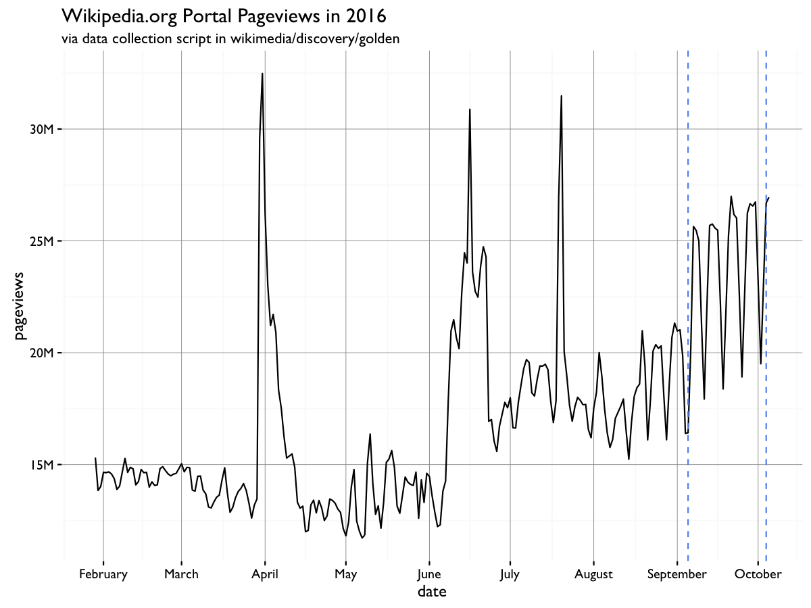
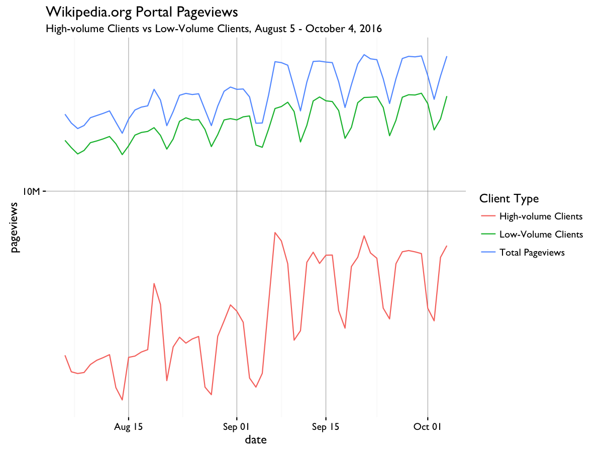
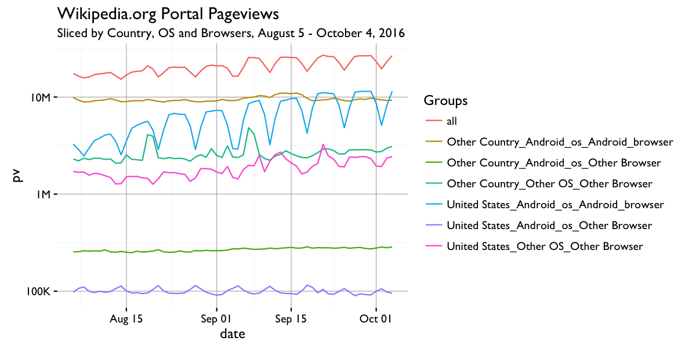
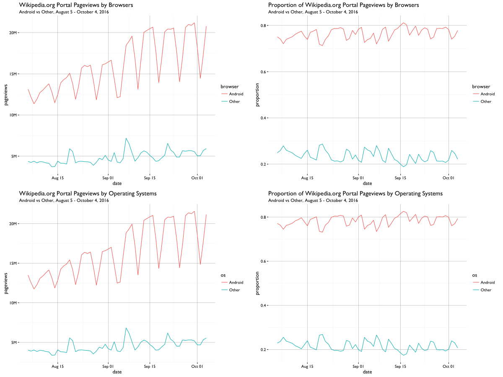
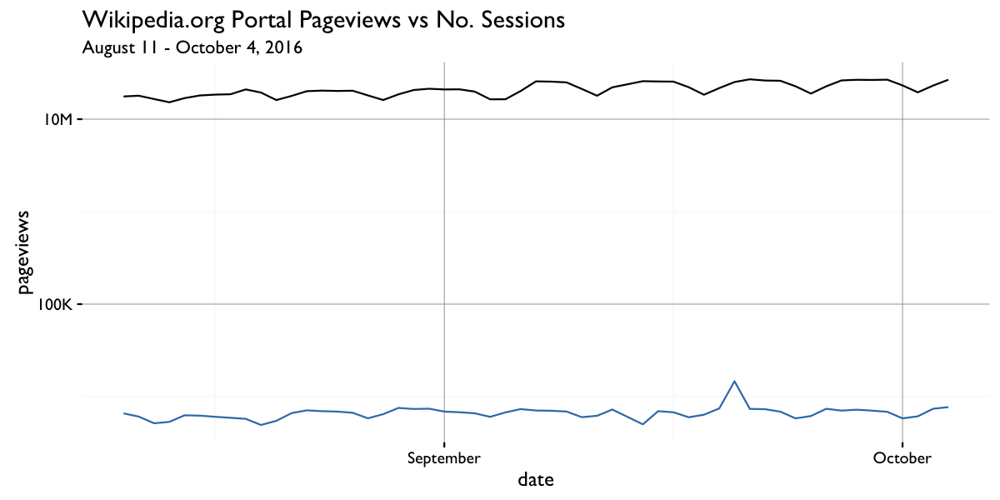
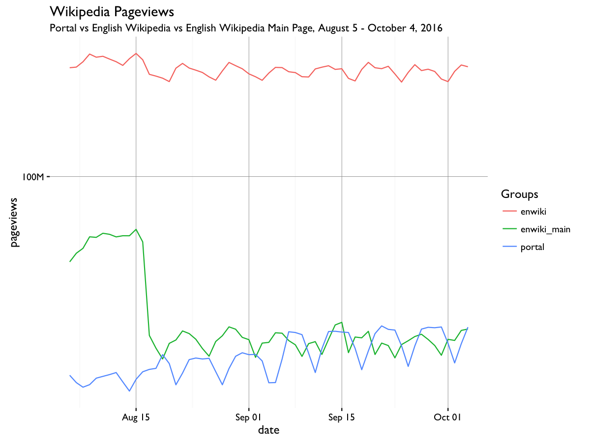

# Spike of Wikipedia.org Portal Pageviews in September 2016

This codebase contains the code used to investigate a spike in pageviews to wikipedia.org, as noted in [T146214](https://phabricator.wikimedia.org/T146214):

Using log scale, we can see that the pageviews of low volume client is increasing gradually, while the pageviews of high volume clients jumped up after 2016-09-06:

It seems that certain high-volume IPs are responsible for the drastic increase after 2016-09-06. But it doesn't explain the reason behind the increase of low-volume clients. Then we tried to sliced the data in several different ways. It seems that daily pageviews from United States, Android OS and Android browser is highly correlated (0.9786050) with total pageviews.

But it doesn't give us a lot more information. Meanwhile, we noticed that **Android pageviews accounts for 70-80% of the total pageviews**, which is very suspicious according to this [dashboard](https://analytics.wikimedia.org/dashboards/browsers/#all-sites-by-os).

Then we checked the number of sessions. There is also a weekly cycle in the number of sessions, but the series is not correlated with the pageview series (0.3813088).

We also checked the pageviews to English wikipedia and English wikipedia main page. We saw a weekly cycle in the pageviews to English wikipedia, but it doesn't match with our portal pageviews.

Correlation Matrix:

|             | enwiki     | enwiki_main | portal     |
|-------------|------------|-------------|------------|
| enwiki      | 1          | 0.7397311   | -0.3653886 |
| enwiki_main | 0.7397311  | 1           | -0.5555959 |
| portal      | -0.3653886 | -0.5555959  | 1          |

## Status
As mentioned above, Android pageviews accounts for 70-80% of the total pageviews, which is very suspicious. My coworker Mikhail did an investigation into this problem and found that many of these pageviews came from the same place, see [T146214](https://phabricator.wikimedia.org/T146214) for more details. Currently we cannot do anything else without further information. 
