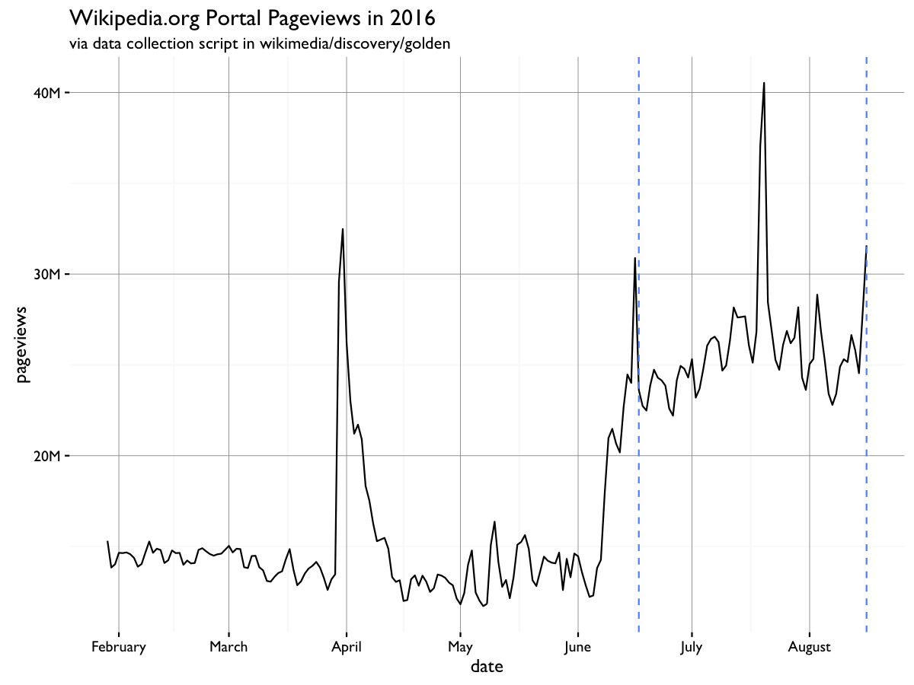
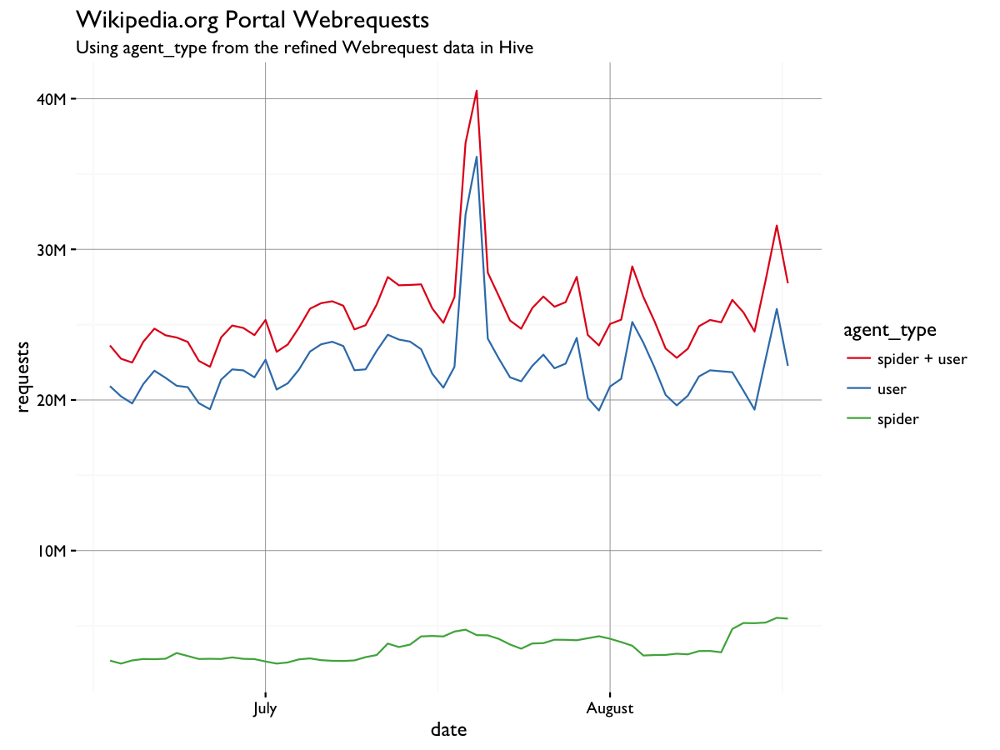
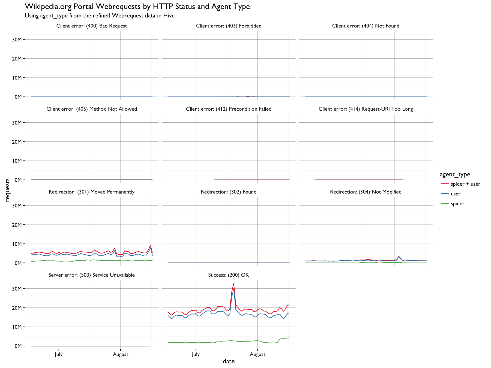
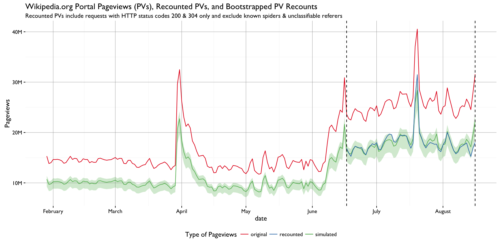

# Rise of Wikipedia.org Portal Pageviews

This codebase contains the code used to investigate a rise in pageviews to wikipedia.org, as noted in [T143045](https://phabricator.wikimedia.org/T143045):

## Part 1

In this part of the analysis, we suspected that not filtering out web requests by status code or agent type might responsible for the rise. First we looked at traffic broken down by agent type ("spider" or "user") and found that known bots account for only a tiny portion of the overall traffic.

Then we looked at traffic brown down by [HTTP status code](https://en.wikipedia.org/wiki/List_of_HTTP_status_codes) and agent type, to see if maybe we're really over-counting pageviews by including web requests with HTTP status codes that should not be included per [our official "pageview" specification](https://meta.wikimedia.org/wiki/Research:Page_view):

When we saw the difference between the original pageviews and recounted pageviews, we made bootstrap simulations of the pageviews given the observed differences:

This filtering will be added to [our pageview-counting script](https://github.com/wikimedia/wikimedia-discovery-golden/blob/master/portal/pageviews.R) in [wikimedia/discovery/golden](https://github.com/wikimedia/wikimedia-discovery-golden) in the nearest future and the pageviews recounted from the earliest available date (we keep about 60 days of webrequest data).

## Part 2

But that still does not explain why we are seeing nearly double the pageviews as we were seeing before June. Unfortunately, pre-June webrequest data does not exist anymore, but at least now we can narrow our investigation to webrequests with HTTP status codes 200 & 304 and agent_type == "user", since those pageviews retain the pattern we were interested in investigating. For this part, we focus on 17 August 2016 because we are investigating 18.43M HTTP requests from that day which satisfy the conditions of a "pageview".
