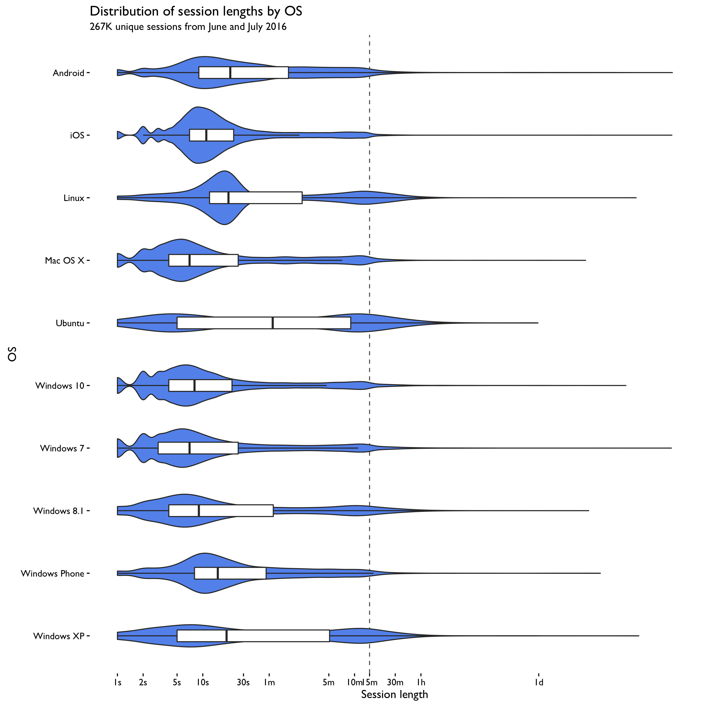
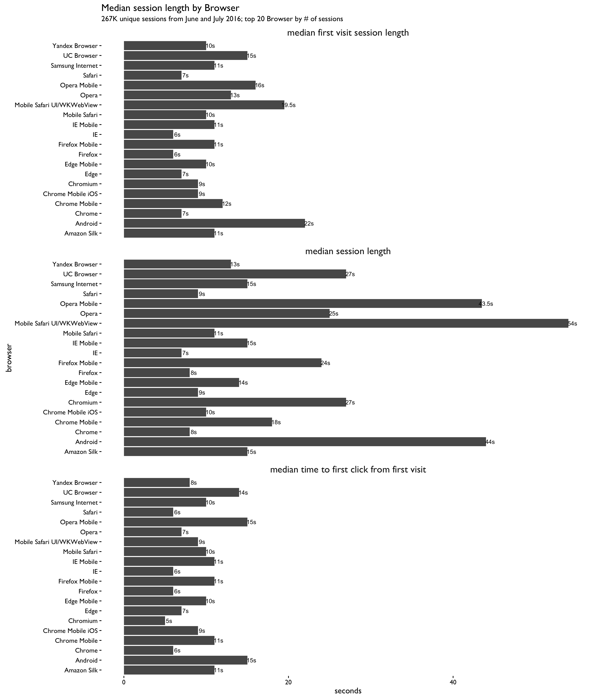
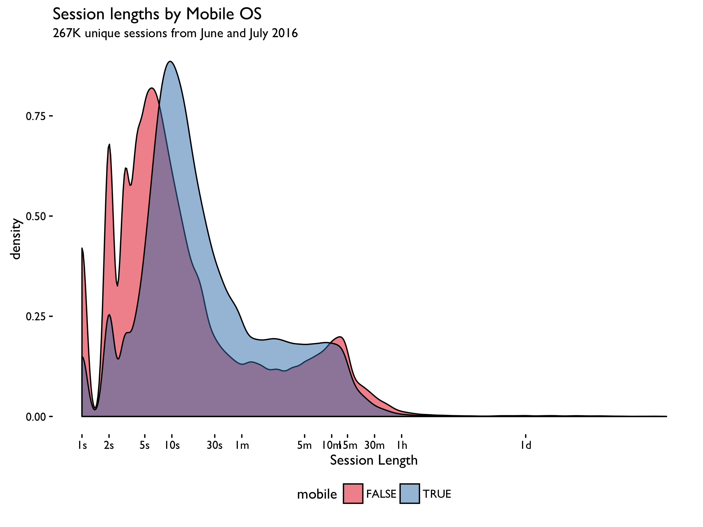
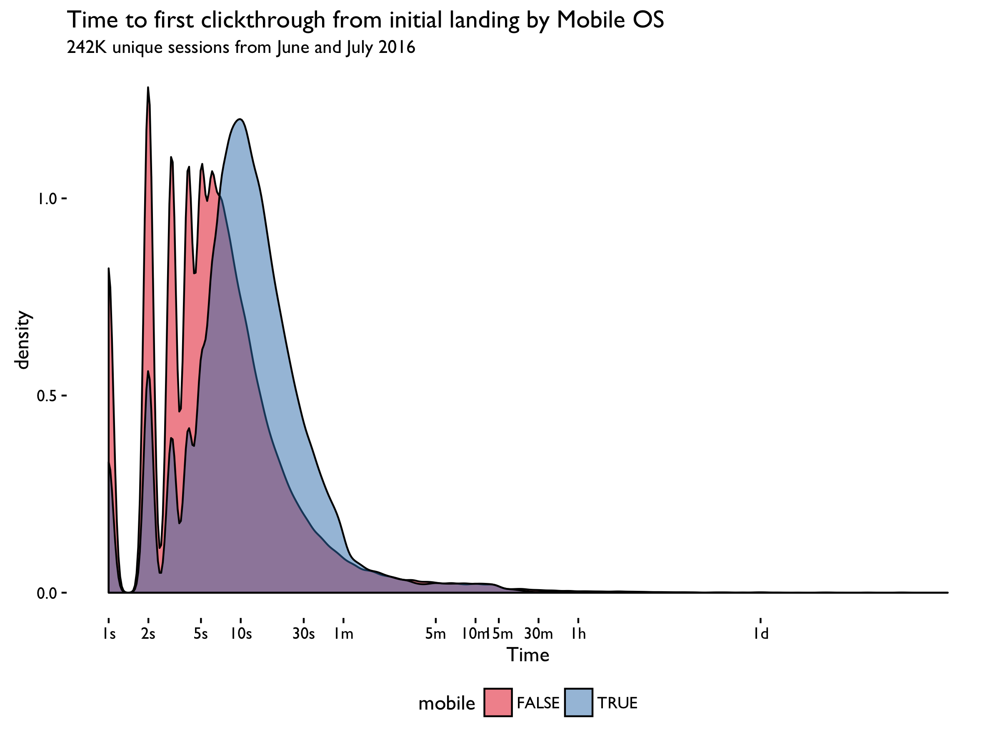

```{r setup, include = FALSE, message = FALSE, warning = FALSE}
knitr::opts_chunk$set(echo = FALSE, message = FALSE, warning = FALSE)
```

\renewcommand{\abstractname}{Executive Summary}
\begin{abstract}
This report takes a further step from the previous one to investigate the difference between OS and browsers. While most sessions are within 1 min, some os/browsers tend to take longer. In the mean time, mobile devices have a longer session length, and take longer to first click through.
\end{abstract}

## Data

The event logging (EL) data was extracted from the database using the script [data.R](https://github.com/wikimedia-research/Discovery-Research-Portal/blob/master/Analyses/Session%20Length%20v2/data.R) and refined into sessions using [refine.R](https://github.com/wikimedia-research/Discovery-Research-Portal/blob/master/Analyses/Session%20Length%20v2/refine.R).

Throughout the report "session length" is calculated as the arithmetic difference between the last recorded event and the first recorded event from a user, uniquely identified by a combination of: session ID, user agent, and language preferences. These are used in tandem to correct for possible session ID clashes.

The user agents are parsed by [ua-parser](https://github.com/ua-parser/uap-r). The device are parsed wrongly, so here we only analyze os and browser. Additionally, if the os of a session is Android, iOS, Windows Phone or BlackBerry OS, we tag it as a mobile session.

\newpage

## Results










