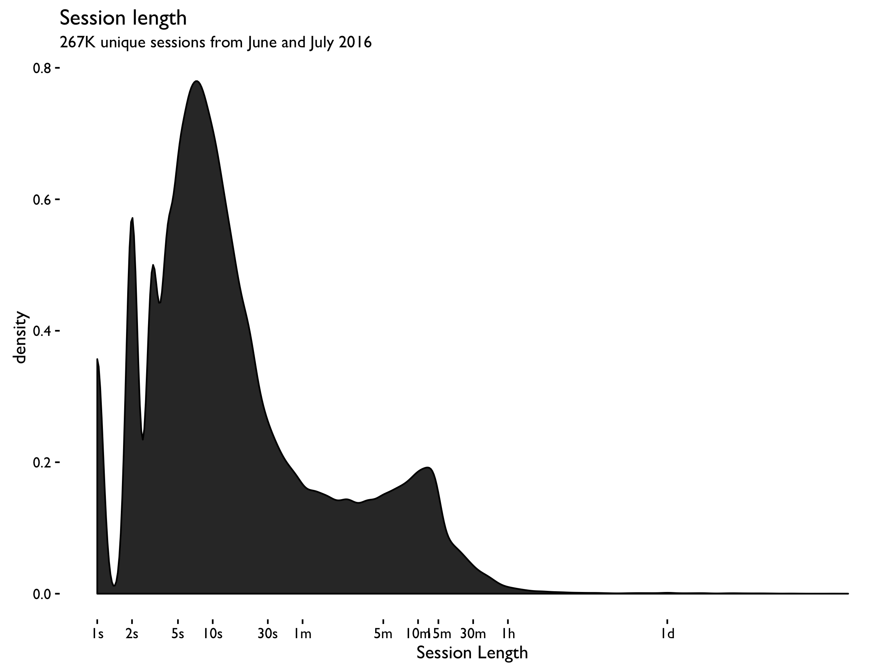
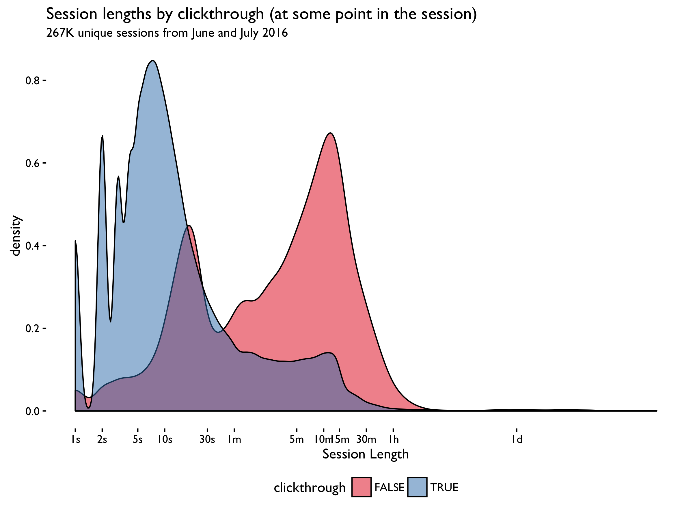
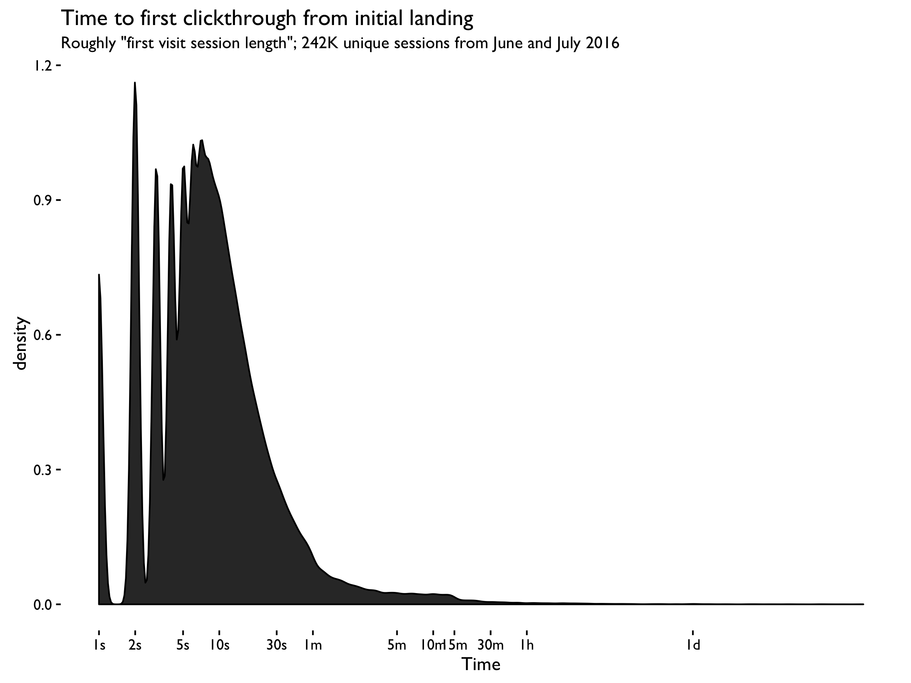

```{r setup, include = FALSE, message = FALSE, warning = FALSE}
knitr::opts_chunk$set(echo = FALSE, message = FALSE, warning = FALSE)
```

\renewcommand{\abstractname}{Executive Summary}
\begin{abstract}
This report is a replicate of Mikhail's report on [June 2, 2016](https://github.com/wikimedia-research/Discovery-Research-Portal/blob/master/Analyses/Session%20Length/report.pdf), based on the event logging data in June and July 2016. 

Our main conclusion remains the same. We found that the most common session length is approximately 10 seconds, and that majority of the sessions are shorter than 1 minute. Around 80\% of the English-using visitors' sessions are shorter than 1 minute, and same for United States visitors, while only 55\% of the Russian-using visitors' sessions are shorter than that.
\end{abstract}

## Data

The event logging (EL) data was extracted from the database using the script [data.R](https://github.com/wikimedia-research/Discovery-Research-Portal/blob/master/Analyses/Session%20Length/data.R) and refined into sessions using [refine.R](https://github.com/wikimedia-research/Discovery-Research-Portal/blob/master/Analyses/Session%20Length/refine.R).

Throughout the report "session length" is calculated as the arithmetic difference between the last recorded event and the first recorded event from a user, uniquely identified by a combination of: session ID, user agent, and language preferences. These are used in tandem to correct for possible session ID clashes.

\newpage

## Results









