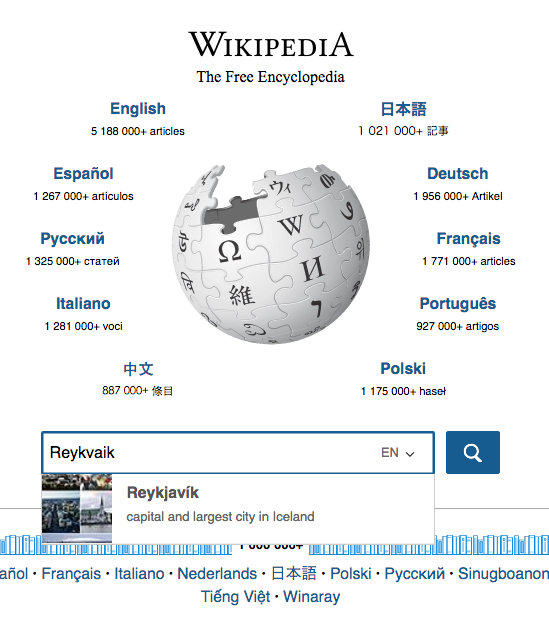
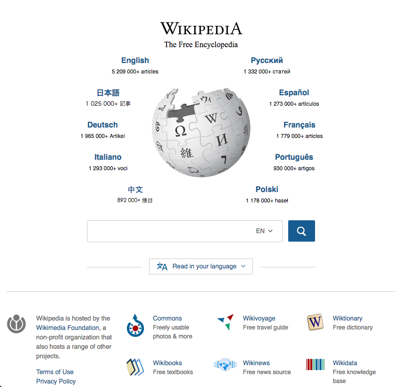
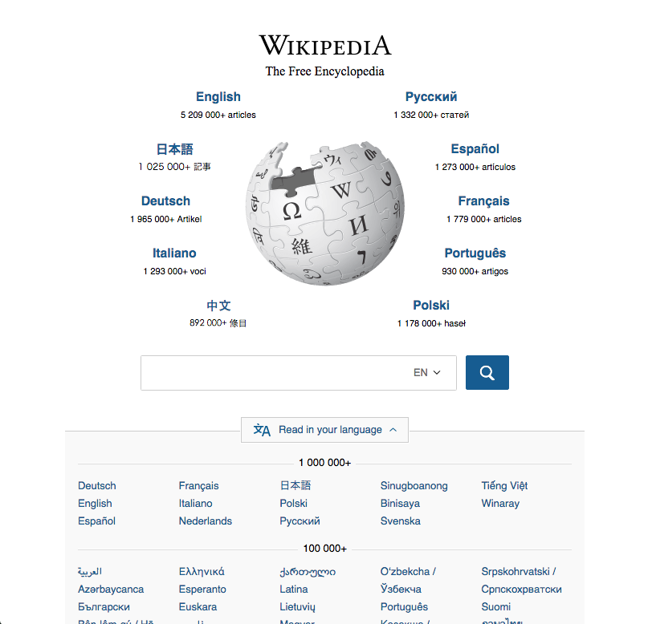

```{r setup, include = FALSE, message = FALSE, warning = FALSE}
knitr::opts_chunk$set(echo = FALSE, message = FALSE, warning = FALSE)
```
<div id = "abstract">
<h2>Executive Summary</h2>
<p>For the past several months, the Portal team within Wikimedia Foundation's Discovery department has been working hard on making visual and practical improvements to the Wikipeda.org Portal page to improve user experience. These changes include a search box with article suggestions, descriptions of other Wikimedia projects, and detecting language and dynamically populating/resorting the links around the globe. Looking back at various engagement metrics, we found slightly increases but engagement with the page has stayed largely the same. Of course, engagement does not correlate with satisfaction, and we currently do not have any methods to measure Portal visitors' satisfaction and whether or not they feel welcome and end up visiting the page again or regularly.</p>
</div>

<p style = "text-align: center;">
  { <a href="https://github.com/wikimedia-research/Discovery-Research-Portal/blob/master/docs/deployments/index.Rmd">RMarkdown Source</a> |
  <a href="https://github.com/wikimedia-research/Discovery-Research-Portal/tree/master/docs/deployments/figures">Figures</a> |
  <a href="https://github.com/wikimedia-research/Discovery-Research-Portal/tree/master/Analyses/Deployments%20Over%20Time">Analysis Codebase</a> |
  <a href="https://commons.wikimedia.org/wiki/File:Impact_of_Wikipedia.org_Portal_Changes_-_A_Retrospective_Statistical_Analysis.pdf">Download PDF</a> }
</p>

## Background

For the past several months, Discovery's Portal UX team -- Deb Tankersley, Jan Drewniak, Moiz Syed (formerly), and Julien Girault (formerly) -- have worked hard to make visual and practical improvements to the Wikipedia.org Portal page. The goal was to improve the experience of wikipedia.org visitors and help them get to the information they are looking for as fast as porrible. These improvements include (but are not limited to) the following major deployments:

1. Search box with type-ahead and metadata ([T125472](https://phabricator.wikimedia.org/T125472)) on March 10th, 2016, which allowed us to present the user with article suggestions as they were typing their search query. The suggestions included images and metadata to help the user get to the article they are looking for.
2. Sister project links with descriptions ([T133732](https://phabricator.wikimedia.org/T133732)) on May 18th, 2016, which added descriptions to the Wikimedia projects we link to at the bottom of the page.
3. Language detection and primary link resorting ([T133432](https://phabricator.wikimedia.org/T133432)) on June 2nd, 2016, wherein we use the visitor's preferred languages settings to insert/rearrange the languages around the Wikipedia globe logo, making it easier and quicker for visitors to continue on to a Wikipedia in their language.

In Figure 1a, we see that by default the language links ("primary links") around the Wikipedia globe logo are the top 10 languages by number of articles. The first language -- English -- is the default language of the search box that:

1. shows the articles the user may be searching for in that particular Wikipedia,
2. shows the article image and some metadata for each suggested (English Wikipedia) result, and
3. uses the Search team's completion suggester feature to figure out the correct spelling.

In Figure 1b, we see what visiting and searching looks like for a user who has set Icelandic as their preferred language, followed by Russian and Korean.

<div>
  <div style = "float: left; width: 48%; margin-right: 2%">
  
  
    
  </div>
  <div style = "float: left; width: 48%; margin-left: 2%">
  
  
  
  </div>
</div>

<div class = "figure-right" style = "width: 60%;">

</div>

Figure 2 shows the links to other Wikimedia Foundation projects such as Commons and Wiktionary. The links are called "sister links". As of 18 May 2016, they include descriptions of the projects. Currently, these descriptions are in English, but work is being done to translate them into the other languages so they dynamically show up in the user's preferred language like the phrase "The Free Encyclopedia" does. See [T142582](https://phabricator.wikimedia.org/T142582) for more details.

## Data

We used the [Siteviews tool](https://tools.wmflabs.org/siteviews) on [Wikimedia Tool Labs](https://wikitech.wikimedia.org/wiki/Portal:Tool_Labs) to obtain the [pageviews](https://meta.wikimedia.org/wiki/Pageviews_Analysis#Siteviews) for English, German, and French Wikipedias, which we used as the noncovariate in the Bayesian structural time series. Wikipedia.org Portal pageviews and clickthroughs were acquired from our [Webrequest data](https://wikitech.wikimedia.org/wiki/Analytics/Data/Webrequest) (via [this R script](https://github.com/wikimedia/wikimedia-discovery-golden/blob/master/portal/pageviews.R)) and our [Event Logging (EL) data](https://wikitech.wikimedia.org/wiki/Analytics/EventLogging) (via [this R script](https://github.com/wikimedia-research/Discovery-Research-Portal/blob/master/Analyses/Deployments%20Over%20Time/data_EL.R)).

Wikipedia.org Portal EL uses [this schema](https://meta.wikimedia.org/wiki/Schema:WikipediaPortal) and a sampling rate of 1 in 200. Once a user visits wikipedia.org, they are randomly selected to be **anonymously tracked** with EL, we record:

- Every time they land on the page while their session is active (see below).
- Every time they click on one of the links on the page. The sections are:
    - **primary links** are the dynamically populated and resorted languages around the Wikipedia globe logo.
    - **secondary links** are links to Wikipedia in other languages.
    - **other projects** are links to other Wikimedia Foundation projects.
    - **search** is when a user interacts with the search box, which either sends them to a search engine results page or to a particular article.
  
Sessions last at least 15 minutes. The timer starts counting down from the user's initial visit to the page. Any clicks they perform while that timer is counting down are recorded by our EL system. If they do not visit the page again in those 15 minutes, the next time they come back to the page we do not record any of their actions and remove the old tracker. After their session expires, they have the same 1 in 200 probability of being selected again. If they do visit the page again in those 15 minutes, we renew the expiration time onthe timer. For this reason, we may have sessions that last hours and have dozens (and even hundreds!) of visits and clicks.

## Exploratory Analysis

Where applicable, we used generalized additive model (GAM) spline-based smoothing to fit a smooth curve to the data to visualize overall, longer-term patterns. Specifically, we used the `s()` function in the **mgcv** R package, with a 4- and 5-dimensional basis for the smooth term (`y ~ s(x, k = 4)` & `y ~ s(x, k = 5)`) in majority of the graphs.

### Pageviews

![**Figure 3**: Pageviews over time with (`k = 20`) smoothing curves overlaid to see underlying trends. Pageviews to English, German, French, and Russian Wikipedias are provided for reference. We were too late to start looking into the April spike, as that webrequest data was purged by the time we started the analysis. The only notable thing in this figure is the rise in <span style = "color: #E76BF3;">pageviews</span> following the Detect Language deployment, which may or may not be caused by it along with increased publicity.](figures/pageviews.png)

### Sessions

![**Figure 4**: Number of unique sessions and visits over time (in <span style = "color: black;">black</span>). The <span style = "color: #E41A1C;">red, dashed smoothing curve</span> (`k = 20`) is closer to the data while the <span style = "color: #377EB8;">solid blue curve</span> (`k = 11`) shows a more general trend. Comparing raw counts of sessions and visits is not completely correct in this case because the way the sampling was done did not completely follow the 1 in 200 rule we initially thought it would. However, an interesting thing to note is that after the release of the language dropdown A/B test and new, more reliable "seeded" sampling method (13 May 2016), we are seeing very stable counts of sessions and visits (see T135558).](figures/daily_aggregates.png)

<hr style = "border-color: #C0C0C0; width: 85%;">


### Clickthroughs

![**Figure 6**: There are 2 GAM-smoothed curves overlayed on the clickthrough (CTR) series: <span style = "color: #E41A1C;">a red, dashed one that more closely resembles the data</span> and <span style = "color: #377EB8;">a blue one that shows us a more general trend</span>. We can see that after the release of the search box, the proportion of sessions with at least one clickthrough has been rather stable with weekly seasonality. The deployments have not moved the general engagement up or down by a noticeable amount. We're still not sure why Saturday of all days seems to be the day where CTR is at its lowest.](figures/ctr.png)

<hr style = "border-color: #C0C0C0; width: 85%;">


### Most Commonly Clicked Section

In Figures 8 and 9 below, we use the "most common section clicked per visit" metric. When the user goes to the Wikipedia.org Portal and gets enrolled into event logging by our random sampling mechanism, they have a tracker that stays alive for at least 15 minutes, with the expiration timer renewing every time the user visits the page within the 15 minute window. Furthermore, on each visit to the page, the visitor can click on any link as many times as they want and open as many tabs to different wikis as they want. This means that for any one page landing event (visit), we can see dozens (and even hundreds!) of clickthrough events, and that each session can consist of dozens (and even hundreds!) of visits. While the graph above uses the "last action taken" metric, the graphs below allow us to see how the most clicked section per visit varies over time.


<hr style = "border-color: #C0C0C0; width: 85%;">


## Conclusions

We will be honest when we say that these are not the results we were hoping for. We were expecting to see each deployment followed by a dramatic increase in an appropriate metric -- mostly engagement. However, these are also not the results we feared. It appears our efforts to make the Wikipedia.org Portal page look nicer and more welcoming have not really had an effect that can be measured through these metrics. We (currently) can't measure overall satisfaction of the visitors. That is, if a person visits the page, feels more welcomed, and ends up going to the page sometime (specifically more than 15 minutes) later, we currently have no way of capturing that, and must rely on some of these engagement metrics.

<div>
  <div style = "float: left; width: 48%; margin-right: 2%">
  
  
    
  </div>
  <div style = "float: left; width: 48%; margin-left: 2%">
  
  
  
  </div>
</div>

On August 16th we deployed a design change that collapses the secondary links into a modal -- see Figure 10 -- which might or might not affect clickthroughs. In making it more modern looking and easier to see, we're hoping (unmeasurable) user satisfaction will go up even if clickthroughs (engagement) might not exactly display that satisfaction. We will monitor the [Portal analytics dashboard](http://discovery.wmflabs.org/portal/) following the rollout.
