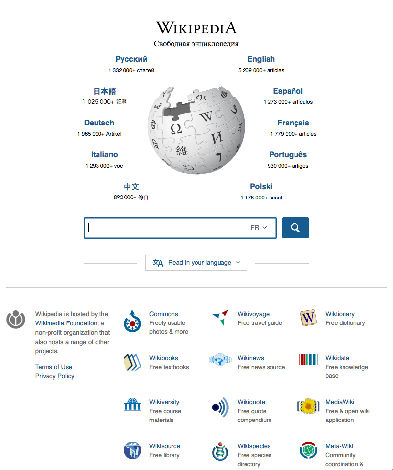
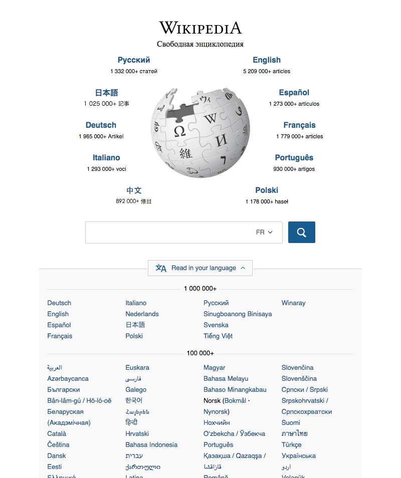
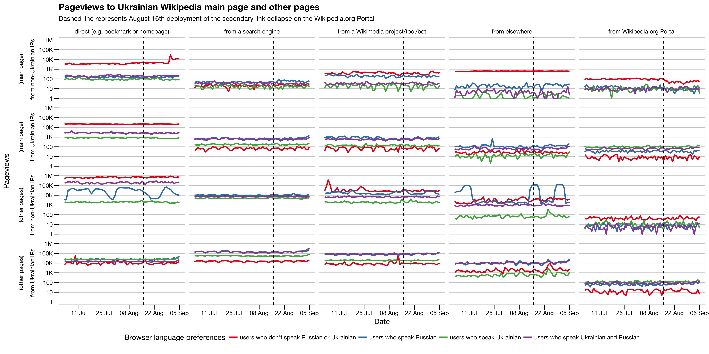

```{r setup, include = FALSE, message = FALSE, warning = FALSE}
library(rmdformats) # https://github.com/juba/rmdformats
knitr::opts_chunk$set(echo = FALSE, message = FALSE, warning = FALSE, fig.path = "figures/")
knitr::opts_knit$set(width = 75)
options(max.print = "75")
library(data.table)
library(bsts)
library(magrittr)
library(ggplot2)
library(dygraphs)
path <- function(x) {
  if (grepl("Analyses/Ukrainian Wikipedia", getwd(), fixed = TRUE)) {
    return(x)
  } else {
    file.path("../../Analyses/Ukrainian Wikipedia", x)
  }
}
```
<div id = "abstract">
<h2>Executive Summary</h2>
<p>On 16 August 2016, Discovery deployed a major design change to the Wikipedia.org Portal page. As of the deployment, the links to Wikipedia in 200+ languages have been put into a modal drop-down to make the page cleaner and less overwhelming to new visitors. Before that, Discovery added language detection to the page so that users (who have their language preferences set in their browser) would see their language around the Wikipedia globe logo, without having to look for it in the long list of languages. Discovery received some criticism about the change, with some users hypothesizing that the change may have resulted in a decrease to Ukrainian Wikipedia's pageviews because some visitors may have Russian set as a language, but not Ukrainian.</p>
<p>In this analysis, we use Bayesian structural time series models to model Ukrainian Wikipedia Main Page (since that's where the Portal leads to) pageviews from Russian-but-not-Ukrainian-speaking visitors to Wikipedia.org Portal. The effect of the deployment was estimated to be negative in some models and positive in others — including ones that looked at Russian-and-Ukrainian-speaking visitors — but the 95% credible interval included 0 in all of them, meaning the effect of the deployment is not statistically significant. In other words, we do have sufficient evidence to say that the language-dropdown deployment had a convincingly positive or negative impact on Ukrainian Wikipedia Main Page pageviews from Wikipedia.org Portal.</p>
</div>

<p style = "text-align: center;">
  { <a href="https://github.com/wikimedia-research/Discovery-Research-Portal/blob/master/docs/ukrainian/index.Rmd">RMarkdown Source</a> |
  <a href="https://github.com/wikimedia-research/Discovery-Research-Portal/tree/master/docs/ukrainian/figures">Figures</a> |
  <a href="https://github.com/wikimedia-research/Discovery-Research-Portal/tree/master/Analyses/Ukrainian%20Wikipedia">Analysis Codebase</a> |
  <a href="https://phabricator.wikimedia.org/T143853">Phabricator Task</a> |
  Download PDF }
</p>

## Background

For the past several months, Discovery's Wikipedia.org Portal team has been working on redesigning the ([wikipedia.org](https://wikipedia.org)) page to have a cleaner, more welcoming, and less overwhelming design and user experience. On 16 August 2016, the team deployed the [final major patch](https://phabricator.wikimedia.org/rWPOR84feffc2ec21fe1e060bf3ffb6e232ab3e259bf0) (for the next foreseeable future) wherein the links to Wikipedia in 200+ languages have been put into a drop-down modal that is hidden by default and is only visible when the user intentionally clicks the "Read in your language" button (see Figure [1a](figures/portal_a.png) and [1b](figures/portal_b.png) below).

<div><div style = "float: left; width: 31%; margin-right: 2%"><a href = "figures/portal_a.png"></a><p class = "caption"><strong>Figure 1 (a)</strong>: Default experience when visiting Wikipedia.org Portal with Russian as the preferred language. Our deployment on August 16th, 2016, collapsed the language links into a hidden-by-default modal in an effort to make the page's design cleaner and less overwhelming to new visitors.</p></div><div style = "float: left; width: 31%; margin-left: 2%"><a href = "figures/portal_b.png"></a><p class = "caption"><strong>Figure 1 (b)</strong>: Link to Ukrainian Wikipedia is only visible by clicking the "Read in your language" button to reveal the modal containing links to Wikipedia in various languages.</p></div><div style = "float: left; width: 31%; margin-left: 2%"><a href = "figures/portal_c.png"></a><p class = "caption"><strong>Figure 1 (c)</strong>: How the Wikipedia.org Portal looks to a user who has set their language preferences to Ukrainian (first) and Russian (second). The links to Ukrainian and Russian Wikipedias are now the first links around the globe.</p></div></div><div style = "clear:left;"></div>

Per [some comments in a thread on mediawiki.org](https://www.mediawiki.org/wiki/Topic:T7n9rhko21e3xawy), there is a suspicion that the deployment of the collapsed language links has decreased the page views to the Ukrainian Wikipedia as a result of some users browsers being configured to Russian, thereby burying the link to the [Ukrainian Wikipedia](https://uk.wikipedia.org/) (shown in Figure 1). The goal of this analysis is to test the hypothesis that the deployment has had a negative impact on visits to Ukrainian Wikipedia's [main page](https://uk.wikipedia.org/wiki/Головна_сторінка) from Wikipedia.org Portal. That is, this analysis is not concerned with Ukrainian Wikipedia overall pageviews or pageviews from somebody searching on Wikipedia.org Portal and going to a specific article or pageviews from search engines and other sources.

.)](figures/pageviews.png)

## Methods

```{r load_bsts_data}
load(path("data/bsts.RData"))
```
We used [Bayesian structural time series](https://en.wikipedia.org/wiki/Bayesian_structural_time_series) (BSTS) to model Ukrainian Wikipedia main page pageviews from Wikipedia.org Portal, using the R package "bsts" (Scott et al., 2016). See [[1]](http://doi.org/10.1504/ijmmno.2014.059942), [[2]](http://doi.org/10.1214/14-AOAS788), and [[7]](https://CRAN.R-project.org/package=bsts) for more details. 

We tried multiple models, including different combinations of:

- seasonality (weekly & monthly) components,
- a [one-back autoregressive](https://en.wikipedia.org/wiki/Autoregressive_model) (AR1) component,
- specific pageview time series as control time series (e.g. Russian Wikipedia Main Page pageviews from Wikipedia.org Portal, Ukrainian Wikipedia Main Page pageviews _not_ from Wikipedia.org Portal),
- [dynamic time warping-matched](https://en.wikipedia.org/wiki/Dynamic_time_warping) pageview time series ("markets") as control time series, such as Ukrainian Wikitionary (Main Page) pageviews from a Wikimedia project/tool/bot (which had the 2<sup>nd</sup> highest similarity).
- a "mix of markets" that included similar markets and markets with the [highest posterior inclusion probability](http://google.github.io/CausalImpact/CausalImpact.html#which-predictor-variables-were-used-in-the-model) via [Bayesian variable selection](http://multithreaded.stitchfix.com/blog/2016/04/21/forget-arima/#bayesian-variable-selection).

When including control time series (e.g. Ukrainian Wikipedia pageviews from a Wikimedia site but not Wikipedia.org Portal), we used static regression (the coefficients were assumed to not vary over time). Specifically, we set $Z_t = \beta^T X_t$ and $\alpha_t = 1$, so that each $p$-th covariate had a coefficient $\beta_p$. All models included an indicator variable $x_{\text{deployment},t}$ of Wikipedia.org Portal secondary link collapse patch deployment as a covariate, meaning that $x_{\text{deployment},t} = 0$ when $t$ is before 16 August 2016, and $x_{\text{deployment},t} = 1$ when $t$ is 16 August 2016 or after, so that $\beta_{\text{deployment}}$ is the effect of the deployment on Ukrainian Wikipedia main page pageviews from Wikipedia.org Portal after accounting for variance in pageviews using various control time series.

```{r bsts_aggregate_state_contribution_plots, fig.height = 28, fig.width = 16, fig.cap = "**Figure 3**: Plots of the 28 BSTS models' predictions (in black and gray) with actual pageviews (blue circles) for comparison. ([Full resolution version](figures/bsts_aggregate_state_contribution_plots-1.png))"}
par(mfrow = c(7, 4))
for (model_name in names(model_list)) {
  if (grepl("RuBNUkS", model_name, ignore.case = TRUE)) {
    y_lim <- c(0, 100)
  } else if (grepl("UkBNRuS", model_name, ignore.case = TRUE) || grepl("UkARuS", model_name, ignore.case = TRUE)) {
    y_lim <- c(0, 200)
  } else {
    if (grepl("in Ukraine", model_name, fixed = TRUE)) {
      y_lim <- c(100, 300)
    } else {
      y_lim <- c(200, 600)
    }
  }
  plot(model_list[[model_name]], "state", main = sub("(.*) // (.*)", "\\2", model_name),
       ylim = y_lim, ylab = "Pageviews")
  title(sub = sub("(.*) // (.*)", "Population: \\1", model_name))
}; par(mfrow = c(1, 1))
```

Twenty different models were considered (see Figure 2) and 9 were chosen according to the models' [R<sup>2</sup>](https://en.wikipedia.org/wiki/Coefficient_of_determination) (proportion by which the residual variance is less than the variance of the original observations).

## Results

```{r best_markets}
market_match$BestMatches %>%
  dplyr::filter(source == "ukrainian wikipedia (main page) from Wikipedia.org Portal") %>%
  dplyr::select(BestControl, RelativeDistance, Correlation) %>%
  dplyr::rename(Control = BestControl,
                Distance = RelativeDistance) %>%
  knitr::kable(format = "markdown", digits = 3)
```

<p class = "caption"><strong>Table 1</strong>: Top 20 most similar pageviews to Ukrainian Wikipedia main page pageviews from Wikipedia.org Portal. These are the time series used as controls in models that use "matched markets".</p>

```{r selected_models_summary_RuBNUkS}
top_models_idx <- lapply(model_list[which(grepl("RuBNUkS //", names(model_list), fixed = TRUE) | grepl("RuBNUkS in Ukraine //", names(model_list), fixed = TRUE))], function(model) {
  summary(model)$rsquare
}) %>% unlist %>% { which(. > 0.6) } %>% unname

quantiles <- matrix(0.0, nrow = length(top_models_idx), ncol = 6)
rownames(quantiles) <- names(model_list)[top_models_idx]
for (model_name in names(model_list)[top_models_idx]) {
  quantiles[model_name, 4:6] <- quantile(model_list[[model_name]]$coefficients[-(1:burn_in), "post_deployment"], c(0.025, 0.5, 0.975))
  quantiles[model_name, 1] <- summary(model_list[[model_name]], burn = burn_in)$rsquare
  quantiles[model_name, 2] <- AIC(model_list[[model_name]])
  quantiles[model_name, 3] <- BIC(model_list[[model_name]])
}; rm(model_name)
colnames(quantiles) <- c("R²", "AIC", "BIC", "Lower95", "Estimate", "Upper95")
rownames(quantiles) <- sub(", AR + seasonality", "", rownames(quantiles), fixed = TRUE)
quantiles <- as.data.frame(quantiles)
quantiles$`Model Nickname` <- rownames(quantiles)
quantiles$`95% CI` = sprintf("(%.2f, %.2f)", quantiles$Lower95, quantiles$Upper95)
quantiles$Lower95 <- NULL; quantiles$Upper95 <- NULL
quantiles$Population <- sub("(.*) // (.*)", "\\1", quantiles$`Model Nickname`)
quantiles$`Model Nickname` <- sub("(.*) // (.*)", "\\2", quantiles$`Model Nickname`)
quantiles <- quantiles[order(quantiles$Population, round(quantiles$`R²`, 3), round(quantiles$BIC, 3), decreasing = c(FALSE, TRUE, TRUE, FALSE)),
                       c("Population", "Model Nickname", "R²", "AIC", "BIC", "Estimate", "95% CI")]
rownames(quantiles) <- 1:nrow(quantiles)
knitr::kable(quantiles, format = "markdown", digits = 3, align = c("l", "r", "r", "r", "r", "c"), row.names = TRUE)
```

<div class = "caption"><strong>Table 2</strong>: Summary metrics — <a href="https://en.wikipedia.org/wiki/Coefficient_of_determination">R<sup>2</sup></a>, <a href="https://en.wikipedia.org/wiki/Akaike_information_criterion">Akaike information criterion (AIC)</a>, <a href="https://en.wikipedia.org/wiki/Bayesian_information_criterion">Schwarz criterion (BIC)</a> — and point estimate & 95% credible interval of the effect of Wikipedia.org Portal's secondary link collapse patch deployment from the top BSTS models of Ukrainian Wikipedia Main Page pageviews from Russian-but-not-Ukrainian-speaking users ("RuBNUkS") -- in general and specifically pageviews from users with IP addresses in Ukraine. All of the following models included weekly and monthly seasonalities and AR(1) components: <ol class = "caption"><li>Russian Wikipedia Main Page pageviews from Wikipedia.org Portal</li><li>No control time series.</li><li>DTW-matched time series.</li><li>Ukrainian Wikipedia non-Main pageviews from Wikipedia.org Portal</li><li>1 and 4</li><li>The following control time series:</li><li>The following control time series:</li><li>Russian Wikipedia Main Page pageviews from Wikipedia.org Portal visitors in Ukraine</li><li>No control time series.</li></ol></div>

```{r top_models_and_colors}
top_models_idx <- lapply(model_list, function(model) {
  summary(model)$rsquare
}) %>% unlist %>% { which(. > 0.9) } %>% unname
```

```{r selected_models_summary}
quantiles <- matrix(0.0, nrow = length(top_models_idx), ncol = 6)
rownames(quantiles) <- names(model_list)[top_models_idx]
for (model_name in names(model_list)[top_models_idx]) {
  quantiles[model_name, 4:6] <- quantile(model_list[[model_name]]$coefficients[-(1:burn_in), "post_deployment"], c(0.025, 0.5, 0.975))
  quantiles[model_name, 1] <- summary(model_list[[model_name]], burn = burn_in)$rsquare
  quantiles[model_name, 2] <- AIC(model_list[[model_name]])
  quantiles[model_name, 3] <- BIC(model_list[[model_name]])
}; rm(model_name)
colnames(quantiles) <- c("R²", "AIC", "BIC", "Lower95", "Estimate", "Upper95")
rownames(quantiles) <- sub(", AR + seasonality", "", rownames(quantiles), fixed = TRUE)
quantiles <- as.data.frame(quantiles)
quantiles$`Model Nickname` <- rownames(quantiles)
quantiles$`95% CI` = sprintf("(%.2f, %.2f)", quantiles$Lower95, quantiles$Upper95)
quantiles$Lower95 <- NULL; quantiles$Upper95 <- NULL
quantiles$Population <- sub("(.*) // (.*)", "\\1", quantiles$`Model Nickname`)
quantiles$`Model Nickname` <- sub("(.*) // (.*)", "\\2", quantiles$`Model Nickname`)
pop_sort <- factor(quantiles$Population, levels = c("RuBNUkS", "RuBNUkS in Ukraine", "UkBNRuS", "UkBNRuS in Ukraine", "UkARuS", "UkARuS in Ukraine", "All Speakers", "All Speakers in Ukraine"))
quantiles <- quantiles[order(as.numeric(pop_sort), round(quantiles$`R²`, 3), round(quantiles$BIC, 3), decreasing = c(FALSE, TRUE, FALSE)),
                       c("Population", "Model Nickname", "R²", "AIC", "BIC", "Estimate", "95% CI")]
rownames(quantiles) <- 1:nrow(quantiles)
knitr::kable(quantiles, format = "markdown", digits = 3, align = c("l", "l", "r", "r", "r", "r", "c"), row.names = TRUE)
```

<div class = "caption"><p style = "font-size: small; margin: 0; padding: 0;"><strong>Table 3</strong>: Summary metrics — <a href="https://en.wikipedia.org/wiki/Coefficient_of_determination">R<sup>2</sup></a>, <a href="https://en.wikipedia.org/wiki/Akaike_information_criterion">Akaike information criterion (AIC)</a>, <a href="https://en.wikipedia.org/wiki/Bayesian_information_criterion">Schwarz criterion (BIC)</a> — and point estimate & 95% credible interval of the effect of Wikipedia.org Portal's secondary link collapse patch deployment as estimated by the following models:</p><ul class = "caption"><li>Ukrainian Wikipedia non-Main Page pageviews from Wikipedia.org Portal</li><li>Russian Wikipedia Main Page pageviews from Portal and Ukrainian Wikipedia non-Main Page pageviews from Wikipedia.org Portal</li><li>Selected control time series: <ul class = "caption"><li>Russian Wikipedia Main Page pageviews from Wikipedia.org Portal</li><li>German Wikipedia Main Page pageviews from Wikipedia.org Portal</li><li>Ukrainian Wikipedia non-Main Page pageviews from Wikipedia.org Portal</li><li>Ukrainian Wikipedia Main Page pageviews not from Wikipedia.org Portal</li><li>Ukrainian Wikipedia Main Page pageviews from a Wikimedia project/tool/bot</li></ul></li><li>Top 2 DTW-matched time series the selected control time series.</li><li>No control time series.</li></ul><p style = "font-size: small; margin: 0; padding: 0;">The different models were fit for the following the following populations:</p><ul class = "caption"><li>"RuBNUkS": Russian-but-not-Ukrainian-speaking visitors. These are users who had Russian but not Ukrainian in their accept-language header, and are of primary interest in this analysis.</li><li>"UkBNRuS": Ukrainian-but-not-Russian-speaking visitors.</li><li>"UkARuS": Ukrainian-AND-Russian-speaking visitors.</li><li>For "All Speakers", we did not filter the pageviews by presence of Ukrainian or Russian in the accept-language header.</li></ul><p style = "font-size: small; margin: 0; padding: 0;">We also fit versions of the models for pageviews that specifically came from IP addresses in Ukraine.</p></div>

In Tables 2 and 3 above, we list several well-fitting models (high R<sup>2</sup>) and show the estimated effect of the deployment. Also included are the 95% credible intervals, which can be interpreted as "there is a 95% probability that the true value of the effect is inside this interval". Whether looking at models of Ukranian Wikipedia Main Page pageviews from Russian-but-not-Ukrainian-speaking visitors to Wikipedia.org Portal or the other models, the effect of the deployment was estimated to be positive in some models and negative in others, and not statistically significant (95% credible interval included 0) in all of them, meaning that we do not have evidence to say that the deployment had a reliably positive or a negative impact.

## References

### Reading

1. Scott, S. L., & Varian, H. R. (2014). Predicting the present with bayesian structural time series. International Journal of Mathematical Modelling and Numerical Optimisation, 5(1/2), 4. http://doi.org/10.1504/ijmmno.2014.059942
2. Brodersen, K. H., Gallusser, F., & Koehler, J. (2015). Inferring causal impact using Bayesian structural time-series models. The Annals of Applied Statistics. http://doi.org/10.1214/14-AOAS788, http://research.google.com/pubs/pub41854.html
3. Larsen, K. (2016, January 13). Making Causal Impact Analysis Easy [Blog post]. Retrieved from http://multithreaded.stitchfix.com/blog/2016/01/13/market-watch/
4. Larsen, K. (2016, April 21). Sorry ARIMA, but I’m Going Bayesian [Blog post]. Retrieved from http://multithreaded.stitchfix.com/blog/2016/04/21/forget-arima/

### Software

```{r packages_refs, results = 'asis'}
c("base", "data.table", "bsts", "dtw", "MarketMatching", "magrittr", "ggplot2", "dygraphs", "rmarkdown", "knitr") %>%
  lapply(function(pkg) { return(format(citation(package = pkg), "text")) }) %>%
  unlist %>%
  {
    paste0((1:length(.)) + 4, ". ", .)
  } %>%
  paste(collapse = "\n") %>%
  gsub("<URL:", "", ., fixed = TRUE) %>%
  gsub(">.", "", ., fixed = TRUE) %>%
  cat
```
